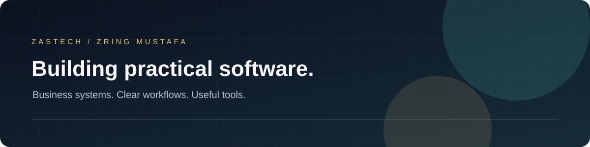

  

  <strong>Business software &nbsp; / &nbsp; Desktop applications &nbsp; / &nbsp; Web platforms</strong>

 

## From everyday workflows to working software

My projects explore the systems behind business and education: financial records, customer relationships, inventory and university operations. I build across web and desktop, bringing interfaces, application logic and data into a coherent workflow.

 

<table>
<tr>
<td width="50%" valign="top">

### 01 &nbsp; Finance &amp; operations

**Accounting foundations and jewellery systems**

Double-entry journals, offline desktop workflows, gold inventory, sales and invoicing.

C# · .NET · WPF · EF Core · Python · Flask

</td>
<td width="50%" valign="top">

### 02 &nbsp; Customer relationships

**CRM and business workflows**

Companies, contacts, leads, opportunities, tasks and activity history in one workspace.

Python · FastAPI · Next.js · PostgreSQL

</td>
</tr>
<tr>
<td width="50%" valign="top">

### 03 &nbsp; Academic platforms

**Connected university operations**

Web applications spanning academic, finance and administration modules.

React · Node.js · Fastify · PostgreSQL

</td>
<td width="50%" valign="top">

### 04 &nbsp; Interactive learning

**Practice through interaction**

Course previews and browser-based activities with locally saved practice entries.

React · Vite · Cloudflare Workers

</td>
</tr>
</table>

 

## Technologies across my projects

| Application layer | Technologies |
| :--- | :--- |
| **Interfaces** | React · Next.js · WPF |
| **Services** | Python · Flask · FastAPI · Node.js · Fastify |
| **Desktop &amp; data** | C# · .NET · Entity Framework Core · PostgreSQL · SQLite |

 

---

  <strong>ZASTECH</strong> 
  A public overview of private projects. Source code and internal materials remain private.

